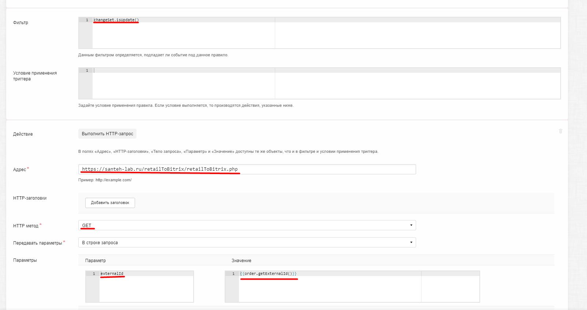
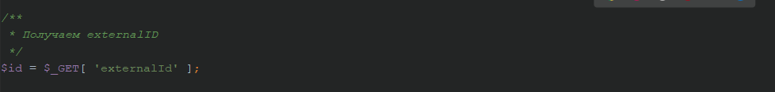

Класс нужно подключать только на стороне Bitrix так как в классе используется api d7 битрикса

Необходимо подключить класс "retail_to_bitix_class.php" 

Ниже приведен пример массива для метода "changePayment".

Ниже приведен пример массива для метода "changeStatus".

Ниже приведен пример массива для метода "сhangeDelivery".

Пример настройки триггера на RetailCrm.

Пример получения externalId на RetailCrm.

Пример использования класса.

